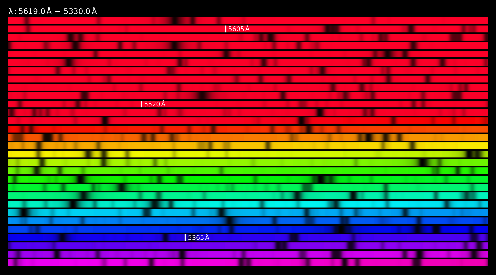

<a href="url"></a> 

# SpectrumImage.jl

[](https://github.com/pe1995/SpectrumImage.jl/actions/workflows/CI.yml?query=branch%3Amain)

Create an image from any spectrum. How to install the package:

```
$ julia --project
               _
   _       _ _(_)_     |  Documentation: https://docs.julialang.org
  (_)     | (_) (_)    |
   _ _   _| |_  __ _   |  Type "?" for help, "]?" for Pkg help.
  | | | | | | |/ _` |  |
  | | |_| | | | (_| |  |  Version 1.11.3 (2025-01-21)
 _/ |\__'_|_|_|\__'_|  |  Official https://julialang.org/ release
|__/

(@v1.9) pkg> add https://github.com/pe1995/SpectrumImage.jl.git
```
All you need to run the code is a spectrum. You can read it however you like, if it is a simple csv file you can just do the following:

```julia
using SpectrumImage

# read the spectrum
data = read_spectrum("my_spectrum.csv", ',')

# create the image
f, ax = spectrum(
    data[:,1], data[:,2], 
    rows=30, figsize=(9, 5), 
    λ_IR=5500,
    show_lambda_range=true, 
    line_indicators=[5605, 5520, 5365], 
    units=L"\rm\, \AA"
)

# save it
f.savefig("example_image.png", dpi=300)
```
In this example, `data[:,1] --> wavelength` and `data[:,2] --> flux`. For more information see the documentation of `spectrum`, i.e. `?spectrum`.
